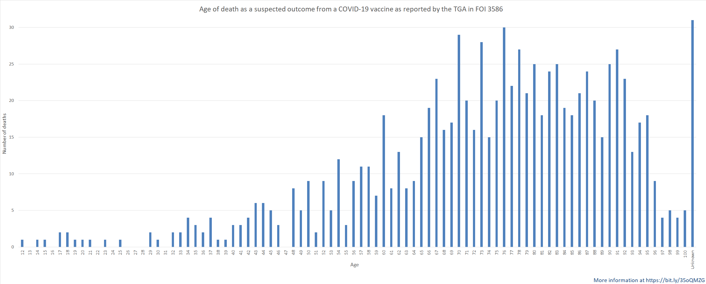
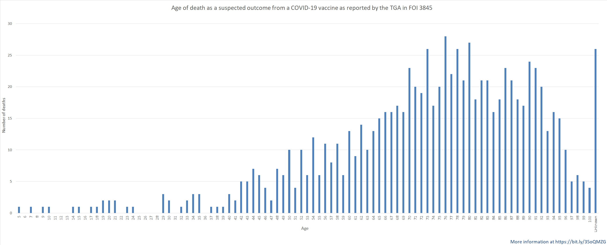

# TGA_FOI

Please see my substack articles on:

* [Analysis of batch data from FOI 3545](https://accaen.substack.com/p/batch-data-from-covid-19-vaccines)

* [The successful FOI request and issues along the way](https://accaen.substack.com/p/interactions-with-the-therapeutic)

Analysis of information obtained through Freedom of Information requests with the Theraputic Goods Administration

Please note that I did not make the initial FOI requests for everything here. I saw FOI 3586 on the [discolosure log](https://www.tga.gov.au/foi-disclosure-log) and made the graph in figure 1 from it. Based on the FOI number I am guessing it goes up to mid-late January 2022.

Figure 1

After seeing FOI 3586 I decided to request an updated version of the same thing (that one only went to 1 Feb 2022). FOI 3845 has just been released and includes suspected deaths from a COVID-19 vaccine up to 27 June 2022. Graph below in figure 2. You can see that a 12 year old was removed from the list for some reason (comparing figs 1 and 2)

Figure 2

